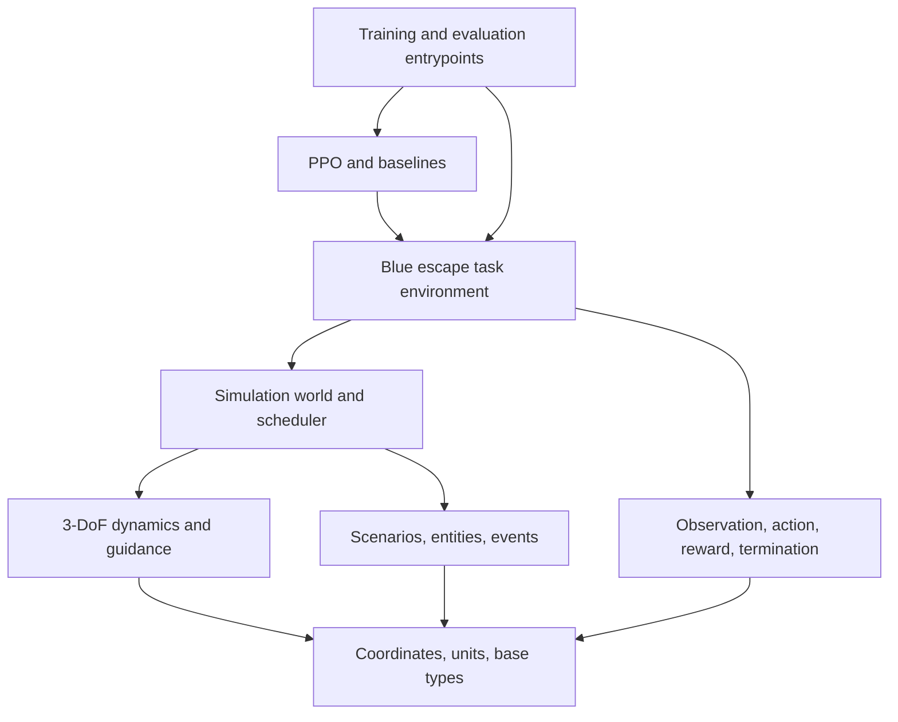

# 01 Target Architecture

The project is organized as a layered architecture: core foundations, domain physics, simulation orchestration, blue escape task components, scene-agnostic PPO algorithms, and application-layer training/evaluation scripts.

